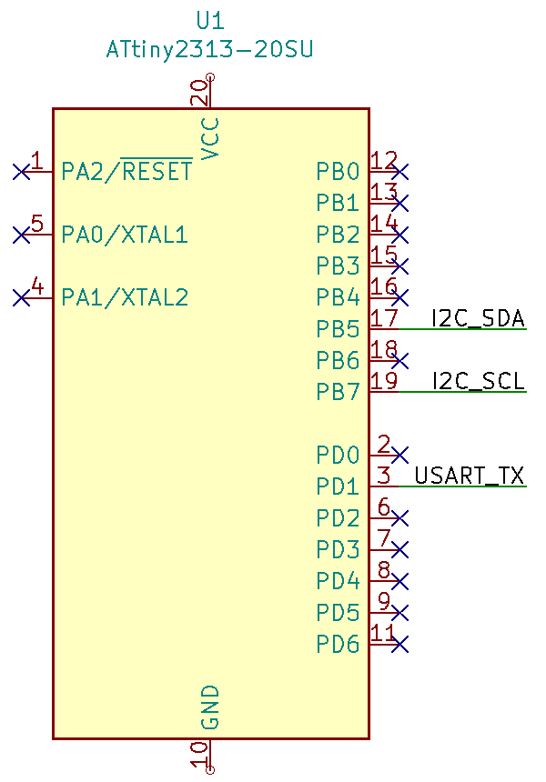

# i2c-tiny-sniffer

**i2c-tiny-sniffer** is a simple sniffer of I2C bus based on ATtiny2313A MCU.

  - I2C speed up to 400Kbps (in theory may be increased to 1Mbps @20MHz @5VDD)
  - Output data in ASCII code from USART (start: `#`, stop: `!`) @1Mbps 7N1 (1/8 of MCU clock frequency)
  - Pins: PB5: I2C SDA, PB7: I2C SCL, PD1: USART TX

Project for AtmelStudio 7.0 IDE.